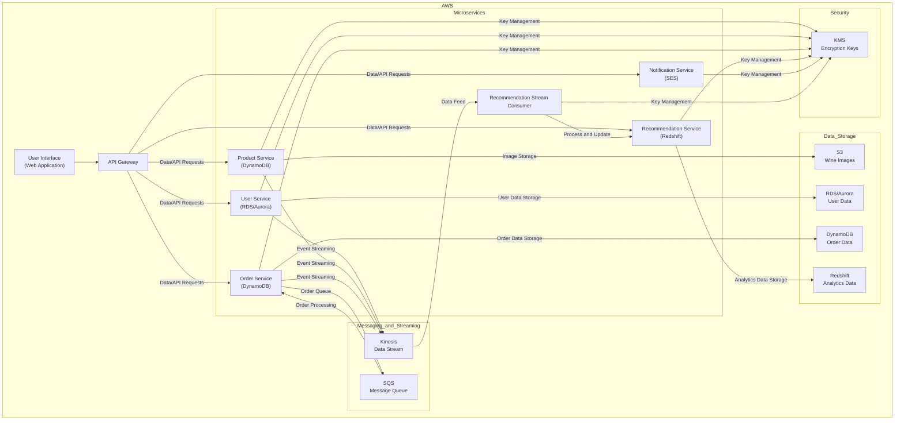

# Wine Store

## Architecture

1. User Interface (UI) Layer

- *Frontend*: A web-based UI where users can browse and purchase wines. This can be hosted on AWS Amplify or S3 with CloudFront for content delivery.

2. Application Layer (Microservices)

- *Product Service*: Manages wine inventory. Uses DynamoDB for storing product details.
- *User Service*: Manages user accounts and profiles. Uses RDS/Aurora for relational data storage.
- *Order Service*: Handles order creation and management. Uses DynamoDB for order data and places orders into an SQS queue.
- *Process Order Service*: Processes orders from the SQS queue. It updates order statuses and handles business logic related to order fulfillment.
- *Recommendation Service*: Provides personalized wine recommendations. Uses machine learning models, potentially leveraging SageMaker, and stores data in Redshift for analysis.
- - *Recommendation Stream Consumer*: Consumes data from the Kinesis data stream and updates the recommendation service with new data.
- *Notification Service*: Sends email notifications (order confirmations, promotions) using SES.

1. Data Storage Layer

- *S3:* Stores static assets like images of wine bottles, digital assets, etc.
- *RDS/Aurora*: Used for relational data that requires complex queries, like user data.
- *DynamoDB*: For high-speed, flexible NoSQL storage, like product catalog and orders.
- *Redshift*: For data warehousing and analytics.

4. Integration and Messaging

- *SQS*: For decoupling microservices, handling message queues for asynchronous processing (e.g., order processing, inventory updates).
- *Kinesis*: For real-time data streaming and analytics, useful for user activity tracking, real-time inventory updates, etc.

5. Security and Encryption

- *KMS*: For managing encryption keys used in the application, ensuring data security across services.

6. Additional Considerations

- *API Gateway*: To manage and route requests to the appropriate microservices.
- *Lambda*: For serverless computing needs, such as running small functions triggered by events (e.g., image processing upon upload to S3).
- *CloudWatch*: For monitoring and logging.
Elasticsearch Service: For advanced search capabilities across the product catalog.
